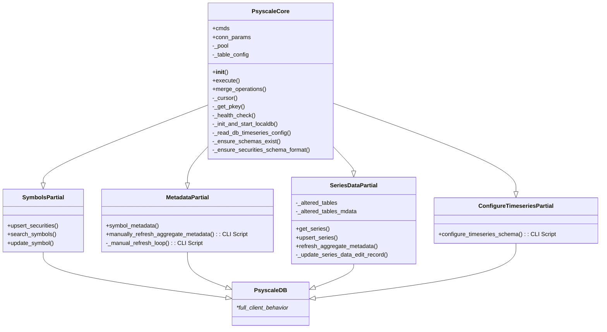

# PsyscaleDB Class Structure

```mermaid
classDiagram
    class PsyscaleCore {
        +cmds
        +conn_params
        -_pool
        -_table_config

        +__init__()
        +execute()
        +merge_operations()

        -_cursor()
        -_get_pkey()
        -_health_check()
        -_init_and_start_localdb()
        -_read_db_timeseries_config()
        -_ensure_schemas_exist()
        -_ensure_securities_schema_format()
    }

    class MetadataPartial {
        +symbol_metadata()
        +manually_refresh_aggregate_metadata(): CLI Script
        -_manual_refresh_loop(): CLI Script
    }

    class SymbolsPartial {
        +upsert_securities()
        +search_symbols()
        +update_symbol()
    }
    
    class SeriesDataPartial {
        -_altered_tables
        -_altered_tables_mdata

        +get_series()
        +upsert_series()
        +refresh_aggregate_metadata()
        -_update_series_data_edit_record()
    }

    class ConfigureTimeseriesPartial {
        +configure_timeseries_schema(): CLI Script
    }

    class PsyscaleDB {
        **full_client_behavior**
    }

    SymbolsPartial --|> PsyscaleDB
    MetadataPartial --|> PsyscaleDB
    SeriesDataPartial --|> PsyscaleDB
    ConfigureTimeseriesPartial --|> PsyscaleDB
    PsyscaleCore --|> SymbolsPartial
    PsyscaleCore --|> MetadataPartial
    PsyscaleCore --|> SeriesDataPartial
    PsyscaleCore --|> ConfigureTimeseriesPartial
```