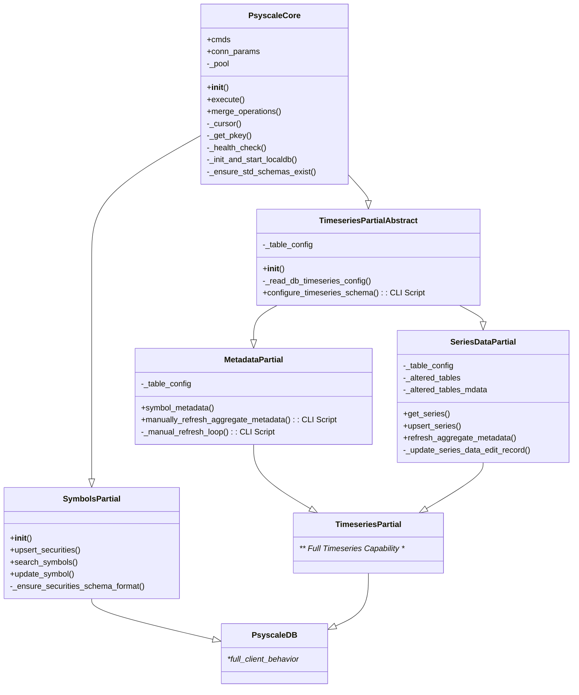
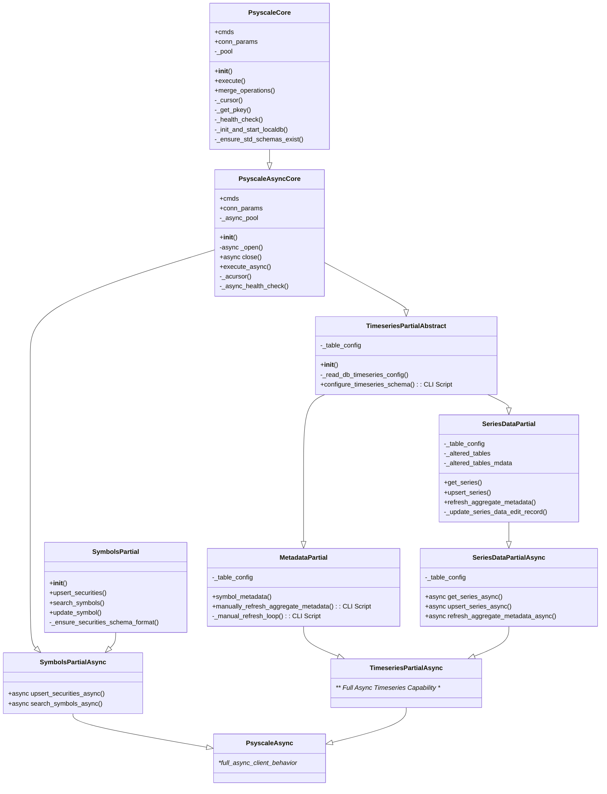

# PsyscaleDB Class Structure

```mermaid
classDiagram
    class PsyscaleCore {
        +cmds
        +conn_params
        -_pool

        +__init__()
        +execute()
        +merge_operations()

        -_cursor()
        -_get_pkey()
        -_health_check()
        -_init_and_start_localdb()
        -_ensure_std_schemas_exist()
    }

    class TimeseriesPartialAbstract {
        -_table_config
        +__init__()
        -_read_db_timeseries_config()
        +configure_timeseries_schema(): CLI Script
    }

    class MetadataPartial {
        -_table_config
        +symbol_metadata()
        +manually_refresh_aggregate_metadata(): CLI Script
        -_manual_refresh_loop(): CLI Script
    }

    class SeriesDataPartial {
        -_table_config
        -_altered_tables
        -_altered_tables_mdata

        +get_series()
        +upsert_series()
        +refresh_aggregate_metadata()
        -_update_series_data_edit_record()
    }
    
    class TimeseriesPartial {
        ** Full Timeseries Capability **
    }

    class SymbolsPartial {
        +__init__()
        +upsert_securities()
        +search_symbols()
        +update_symbol()
        -_ensure_securities_schema_format()
    }
    


    class PsyscaleDB {
        **full_client_behavior**
    }

    SymbolsPartial --|> PsyscaleDB
    MetadataPartial --|> TimeseriesPartial
    SeriesDataPartial --|> TimeseriesPartial
    TimeseriesPartialAbstract --|> MetadataPartial
    TimeseriesPartialAbstract --|> SeriesDataPartial
    TimeseriesPartial --|> PsyscaleDB
    PsyscaleCore --|> SymbolsPartial
    PsyscaleCore --|> TimeseriesPartialAbstract
```

# PsyscaleAsync Class Structure

```mermaid
classDiagram
    class PsyscaleCore {
        +cmds
        +conn_params
        -_pool

        +__init__()
        +execute()
        +merge_operations()

        -_cursor()
        -_get_pkey()
        -_health_check()
        -_init_and_start_localdb()
        -_ensure_std_schemas_exist()
    }

    class PsyscaleAsyncCore {
        +cmds
        +conn_params
        -_async_pool

        +__init__()
        -async _open()
        +async close()
        +execute_async()

        -_acursor()
        -_async_health_check()
    }

    class TimeseriesPartialAbstract {
        -_table_config
        +__init__()
        -_read_db_timeseries_config()
        +configure_timeseries_schema(): CLI Script
    }

    class MetadataPartial {
        -_table_config
        +symbol_metadata()
        +manually_refresh_aggregate_metadata(): CLI Script
        -_manual_refresh_loop(): CLI Script
    }

    class SeriesDataPartial {
        -_table_config
        -_altered_tables
        -_altered_tables_mdata

        +get_series()
        +upsert_series()
        +refresh_aggregate_metadata()
        -_update_series_data_edit_record()
    }

    class SeriesDataPartialAsync {
        -_table_config
        +async get_series_async()
        +async upsert_series_async()
        +async refresh_aggregate_metadata_async()
    }
    
    class TimeseriesPartialAsync {
        ** Full Async Timeseries Capability **
    }

    class SymbolsPartial {
        +__init__()
        +upsert_securities()
        +search_symbols()
        +update_symbol()
        -_ensure_securities_schema_format()
    }

    class SymbolsPartialAsync {
        +async upsert_securities_async()
        +async search_symbols_async()
    }
    
    class PsyscaleAsync {
        **full_async_client_behavior**
    }

    PsyscaleCore --|> PsyscaleAsyncCore

    PsyscaleAsyncCore --|> SymbolsPartialAsync
    PsyscaleAsyncCore --|> TimeseriesPartialAbstract
    SymbolsPartial --|> SymbolsPartialAsync
    SymbolsPartialAsync --|> PsyscaleAsync

    TimeseriesPartialAbstract --|> MetadataPartial
    TimeseriesPartialAbstract --|> SeriesDataPartial
    SeriesDataPartial --|> SeriesDataPartialAsync
    
    MetadataPartial --|> TimeseriesPartialAsync
    SeriesDataPartialAsync --|> TimeseriesPartialAsync
    TimeseriesPartialAsync --|> PsyscaleAsync
```