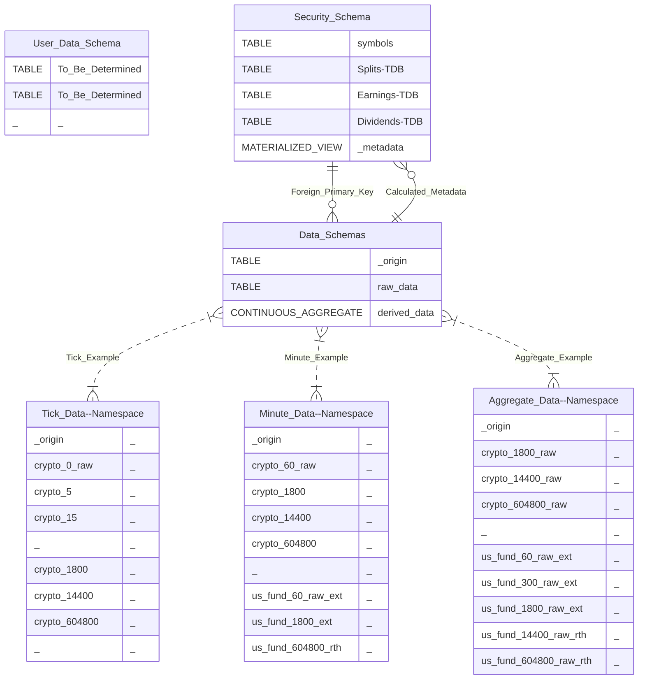

# Database Schema Relationships

```mermaid
erDiagram

    User_Data_Schema {
        TABLE To_Be_Determined
        TABLE To_Be_Determined
        _ _
    }

    Security_Schema {
        TABLE symbols
        TABLE Splits-TDB
        TABLE Earnings-TDB
        TABLE Dividends-TDB
        MATERIALIZED_VIEW _metadata
    }

    Data_Schemas {
        TABLE _origin
        TABLE raw_data
        CONTINUOUS_AGGREGATE derived_data
    }

    Minute_Data--Namespace {
        _origin _
        crypto_60_raw _
        crypto_1800 _ 
        crypto_14400 _
        crypto_604800 _  
        _ _
        us_fund_60_raw_ext _
        us_fund_1800_ext _ 
        us_fund_604800_rth _
    }

    Aggregate_Data--Namespace {
        _origin _
        crypto_1800_raw _ 
        crypto_14400_raw _
        crypto_604800_raw _ 
        _ _
        us_fund_60_raw_ext _
        us_fund_300_raw_ext _ 
        us_fund_1800_raw_ext _ 
        us_fund_14400_raw_rth _ 
        us_fund_604800_raw_rth _
    }
    
    Tick_Data--Namespace {
        _origin _
        crypto_0_raw _
        crypto_5 _
        crypto_15 _
        _ _
        crypto_1800 _ 
        crypto_14400 _
        crypto_604800 _ 
        _ _
    }

    

    %% Relationships
    Security_Schema ||--o{ Data_Schemas : Foreign_Primary_Key
    Security_Schema }o--|| Data_Schemas : Calculated_Metadata
    Data_Schemas }|..|{ Tick_Data--Namespace : Tick_Example
    Data_Schemas }|..|{ Minute_Data--Namespace : Minute_Example
    Data_Schemas }|..|{ Aggregate_Data--Namespace : Aggregate_Example
```