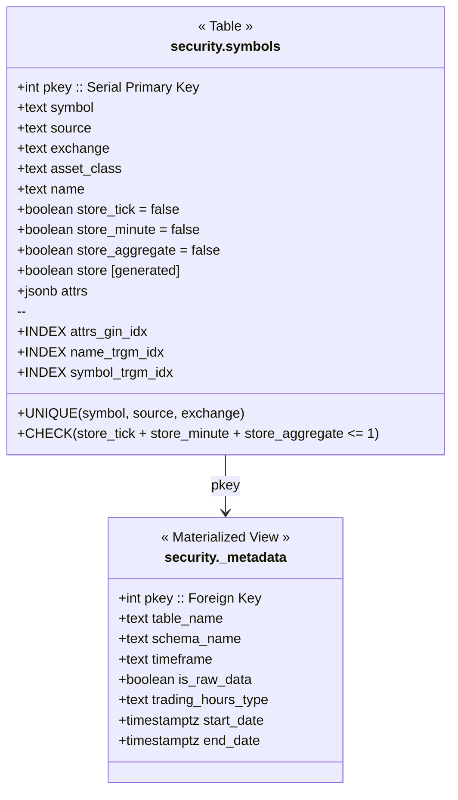
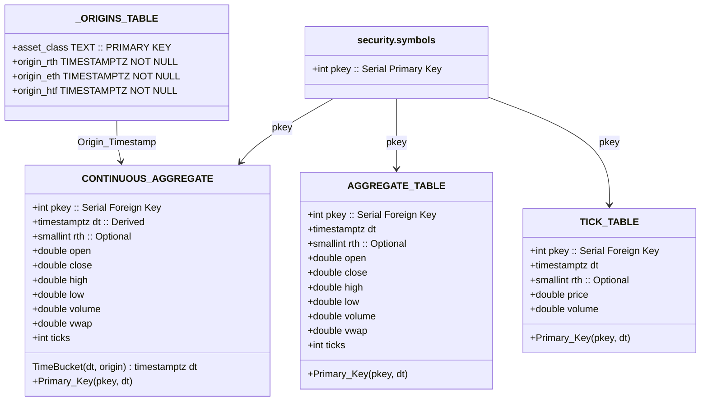

# Security Schema

# Schema: Data_Schemas

### Data Table Naming Scheme : 
### <asset_class>_<_timeframe>[_raw][_ext/_rth /_eth]
- Asset_class : set of assets grouped by origin timestamp
- _timeframe : # of seconds aggregated into a time_bucket. 
    - Tick Tables have timeframe == 0
- [_raw] : Optional 'raw' flag to denote if data was inserted
    - Has flag : Table contains data that was instered from a data broker. Must have manual data insertions in the future
    - No flag : Table is a continuous aggregate that must be refreshed after data insertions
- [_ext/_rth /_eth] : Optional Extended Trade Hours Flag. 
    - No Flag: Asset is in a market that has no extended trade hours
    - _ext : Asset has Extended Trade Hours. This table contains an 'rth' column. 
        - Bars cleanly aggregate both 'rth' and 'eth' times
    - _rth : Asset has Extended Trade Hours. This table has no 'RTH' column, it is only 'rth' data aggregated to the 'rth_origin' timestamp.
    - _eth : Asset has Extended Trade Hours. This table contains an 'rth' column and data is only aggregated to the 'eth_origin' timestamp.
        - '_eth' Tables don't cleanly aggregate to both 'rth' and 'eth' Timeframes. e.g. 1hr bars on NYSE. 
        - The Aggregates cross over the 'rth'/'eth' boundry containting data from both ranges. 'rth' column takes the label the aggregate begins in.

### Extended Trade Hours Session Map:
- EXT_MAP = 
    - "pre": 1,
    - "rth_pre_break": 0,
    - "rth": 0,
    - "break": 3,
    - "rth_post_break": 0,
    - "post": 2,
    - "closed": -1
    
